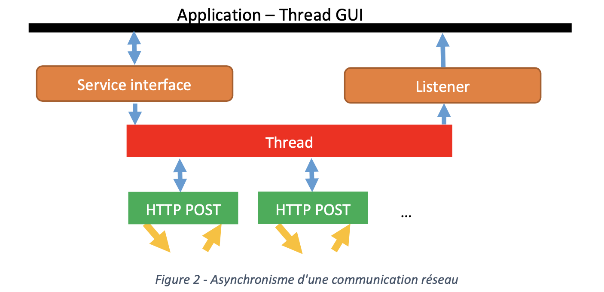

# SYM - Laboratoire 2

## Introduction

Ce laboratoire entend proposer une introduction aux techniques de programmation réparties asynchrones. Beaucoup plus complexes à maîtriser que les techniques synchrones, la programmation asynchrone est connue surtout dans le monde des interfaces utilisateurs, bien que ces dernières abusent trop souvent de dialogues dits "modaux" pour éviter la complexité induite par les interactions asynchrones.
Dans le monde du développement web, historiquement les sites internet étaient/sont encore basés sur un modèle synchrone : l’utilisateur attend que la page soit entièrement chargée avant de pouvoir interagir avec. Depuis environs une dizaine d’année, l’*AJAX* (asynchronous Javascript and XML) permet de réaliser des applications web asynchrones, sans pour autant que les spécificités du monde mobiles soient prises en compte (connexion temporairement indisponible, mauvais débit, gestion d’énergie, etc.). Dans ce laboratoire nous allons illustrer l’utilisation de différentes techniques de protocoles asynchrones pour du mobile.

### Prérequis

* Serveur applicatif accessible sur [http://sym.iict.ch/](http://sym.iict.ch/). Plusieurs services sont définis sur ce serveur, entre autre le plus simple [http://sym.iict.ch/rest/txt](http://sym.iict.ch/rest/txt) qui implémente un service écho, vous lui POSTez du texte (Content-Type: text/plain) et il vous l’envoie en retour accompagné de certaines informations sur le serveur. Le serveur met aussi à disposition un service [http://sym.iict.ch/rest/lorem/20](http://sym.iict.ch/rest/lorem/20) qui retourne du contenu textuel.

### Le client

Historiquement, le client est un acteur peu actif dans la relation client-serveur : c'est celui qui consomme l'information qui lui est mise à disposition sur le web. Pratiquement, ce modèle un peu simpliste se voit systématiquement invalidé depuis l'apparition de terminaux mobiles relativement performants. Le client est devenu producteur d'informations ; la majorité des images d’événements de ces quelques dernières années ont été produites par des amateurs armés de smartphones (cf. Fig.1 8 ans de différence).


Les applications professionnelles n'ont pas été en reste. Dans de nombreux secteurs industriels (chantiers, productique, médecine, sécurité, etc.), les terminaux mobiles ultra-portables sont devenus des fournisseurs d’information incontournables. Cette évolution des rôles du consommateur vers le producteur n'est pas sans incidence sur les caractéristiques des protocoles utilisés. En effet, un consommateur n'a pas d'autre choix que d'attendre que l'information qu'il demande soit disponible ; un producteur en revanche relève d'une logique très différente : lorsqu'il a produit son information, il n'a pas de raison particulière d'attendre que cette information soit parvenue à destination ; généralement, il a d'autres tâches en attente ! L'action d'envoyer l'information sur le réseau doit donc être instantanée, même si la transmission elle-même peut prendre un peu de temps, voire être différée pendant un temps non négligeable (parfois plusieurs jours) pour des raisons d'indisponibilité de réseau. Le fait de rendre la main immédiatement à l'utilisateur implique un protocole asynchrone. En simplifiant, la transmission s'effectue dans le contexte d'un thread indépendant qui va gérer le protocole d'application ; la notification de succès ou d'échec de la transmission, voire une éventuelle indication de réponse, devra être effectuée en utilisant un mode de notification indépendant de l'application (par exemple `Android NotificationManager`, ou similaire pour d'autres plateformes).

Même si l'application fonctionne de manière asynchrone par rapport aux communications, le protocole de transport, lui, reste synchrone. La Fig. 2 illustre cette dualité.



### Protocole et service

Un protocole comporte toujours 2 aspects, comme le modèle OSI le montre de manière très claire :

* L'aspect communication : cet aspect n'est que peu maîtrisable par le développeur d'applications, puisqu'il dépend d'éléments n'étant pas sous contrôle.
* L'aspect service : dans ce cas, le développeur a beaucoup plus de choix (et donc de responsabilités) sur le comportement de son applicatif. C'est dans notre cas l'aspect service qui nous intéresse, car c'est ce dernier qui va permettre à notre application de fonctionner de manière parfaitement asynchrone relativement au protocole réseau, sur lequel nous n'avons que peu d'influence.

### Fonctionnement en l'absence de réseau

Une application professionnelle doit, dans la mesure du possible, permettre un travail aussi en l'absence de réseau. On voit mal un médecin se trouver dans l'incapacité de dicter des notes ou une ordonnance pour un patient simplement parce qu'il se trouve dans une campagne trop isolée pour intéresser les opérateurs de télécommunications. De manière similaire, un fonctionnaire des douanes ne peut pas interrompre le déchargement d'un avion-cargo parce qu'une indisponibilité de réseau l'empêche de documenter les produits qui sont extraits des cales.
Le service applicatif se doit donc de comporter une fonction de cache efficace, sûre et aussi transparente que possible. Cette fonctionnalité est contenue, dans la figure ci-dessus dans le Thread représenté par le bloc rouge.

## Le serveur

Le serveur est moins conditionné par cette notion de synchronisme ou asynchronisme du service, car généralement il n'a que cela à faire : attendre une communication et y répondre.

Là encore, cette vision des choses est peut-être un peu étroite. Elle se réfère à un modèle Web où la requête du client est de nature consultative. Je veux consulter le programme TV de ce soir, ou consulter les horaires de chemin de fer : une requête HTTP se traduit en une autre requête SQL, qui voit son résultat traduit en une page HTML ou de données (ex : JSON) que le client pourra analyser. Ce genre de requête très simple peut être aisément traitée par un serveur basé sur des langages de script, du type php.

Lorsque le client devient producteur d'informations, le traitement par le serveur peut devenir non trivial, et corollairement, le temps nécessaire à la constitution de la réponse peut également devenir trop grand, surtout en cas de surcharge du serveur. La réponse ne venant pas, le client conclura à un time-out de la communication, ce qui aura pour effet de répéter la procédure quelque temps après, contribuant à la surcharge du serveur, etc...

L'asynchronisme du serveur devient alors un paramètre important à considérer dans le design applicatif ; mais cet asynchronisme n'est pas pour autant évident à implémenter. Deux difficultés se présentent :

* Le protocole HTTP est synchrone ; il faut donc répondre avant d'en avoir terminé avec le traitement effectif. Plusieurs options se présentent :
  
  * Valider la requête ("202 Accepted"/"400 Bad Request") avant d'en avoir effectué le traitement effectif et renvoyer cette réponse immédiatement, éventuellement accompagnée d’un numéro de ticket qui permettra au client de suivre ultérieurement l’avancement du traitement. Ceci est faisable dans la majorité des cas, pour autant que le protocole d'application soit conçu dans cette optique ; par exemple, une syntaxe XML s'appuyant sur une DTD ou un schéma permet de valider le document avant d'en avoir traité le contenu.

  * L'application peut être conçue de manière à ne requérir aucune validation ; c'est souvent le cas pour les saisies simples (logging, par exemple) ou pour les applications de traçage semi-automatique. Dans ce cas, une réponse constante "202 Accepted" permet d'assurer le client que les données ont été reçues et de vider cette information de son cache.

* Les serveurs d'application traditionnels (PHP, par exemple) ne sont pas conçus pour le travail parallèle ; même s'il n'est pas impossible de faire du multitraitement quasi-parallèle en PHP, ce n'est pas simple pour autant, parce que l'infrastructure n'est pas conçue pour ce faire (pas de multi-threading natif). Il faut donc se rabattre vers des serveurs applicatifs plus sophistiqués, comme .NET ou J2EE ; mais ces derniers sont souvent nettement plus complexes à mettre en œuvre, et beaucoup moins bien supportés par les fournisseurs de service Internet. De son côté Node.js est en train de mettre en place une nouvelle architecture permettant de réaliser des tâches lourdes en arrière-plan1.

### Transmission d'objets

Dans une application répartie, il est souvent nécessaire d'échanger des objets complexes, pas seulement des textes. Transmettre un objet implique que l'instance de l'objet en question soit **sérialisable** (puisse être représentée sous forme d'une suite de bits). Lorsque le protocole applicatif se fonde sur HTTP (un protocole permettant principalement la transmission de texte), il est recommandé de convertir l'objet en un texte (qui lui est facilement sérialisable). Plusieurs techniques sont à notre disposition dans le cadre des services web, où ce type de transmission est majoritairement utilisé, on trouve par exemple SOAP, XML-RPC, GraphQL ou REST-JSON.

### SOAP, XML-RPC, GraphQL ou REST-JSON

La notion de service Web est une notion relativement floue, qui tend à recouvrir toute fonction implémentée sur un serveur et invocable par un client en utilisant HTTP comme protocole applicatif sous-jacent. Pourtant, il existe différentes implémentations de services web, qui ne sont en principe rien d'autre que des appels de fonctions à distance simplifiés. Ces services présentent des solutions différentes à une série de problèmes communs :

* Automatisation du problème de sérialisation / dé-sérialisation (marshalling et unmarshalling dans la terminologie RPC classique). Pour contourner l'hétérogénéité des systèmes, ces protocoles utilisent une représentation textuelle des données. Cette technique permet effectivement de se débarrasser des traditionnels "stubs" et "skeletons" des technologies RPC traditionnelles, mais introduisent en revanche diverses autres sources de problème, comme le codage des caractères. Cette automatisation est très intéressante pour des raisons de rapidité et de fiabilité de développement (facilement debugable à l’aide d’outils comme *Postman* ou *Wireshark*).

* Normalisation du protocole applicatif. On peut souhaiter ouvrir son service Web à tout un chacun, ce qui implique que le protocole soit standardisé. Dans notre cas de figure, cette condition est moins contraignante, les partenaires de la communication devant de toutes façons utiliser un code spécialisé et mutuellement connu pour échanger des informations.

* Existence de librairies éprouvées. Tester et valider un protocole est une opération fastidieuse et coûteuse.

* Efficacité du protocole. On tend à mépriser cet aspect actuellement, habitués à disposer de réseaux performants ; mais dans le monde de la mobilité, les débits sont extrêmement variables, d'autant plus si on désire à terme s'exporter vers d'autres pays où la notion de mobilité prend peut-être un sens encore plus significatif que dans nos régions. Utiliser un service web classique est en soi une solution peu adaptée sur du mobile en raison de la grande redondance du protocole et de la représentation textuelle. Il peut donc être préférable d'utiliser des protocoles aussi compacts que possible pour économiser la largeur de bande au maximum.

* Possibilité de valider le protocole. Il est intéressant, à la réception d'une unité de protocole applicatif (APDU) de pouvoir affirmer que cette APDU respecte ou non le protocole défini avant de commencer son interprétation.

#### SOAP

SOAP implémente le paradigme "Remote Procedure Call" sur une base HTTP (modèle WS-*). Généralement, on conseille d'utiliser plutôt HTTPS, car SOAP n'est que très peu sécurisé par lui-même; ceci est d'ailleurs le cas pour toutes les applications utilisant des services Web, il faut le souligner. Exporter un service web au-delà d'un intranet constitue une opération représentant un certain risque sécuritaire.

SOAP a le mérite d'une certaine normalisation ; l'utilisation de WSDL (Web Services Definition Language) permet d'automatiser en partie la génération de code entre les partenaires de la communication ; il a en revanche l’inconvénient de la lourdeur des enveloppes entourant les messages échangés. Il n'est pas implémenté en standard sur la plateforme Android, Google privilégiant un modèle REST pas forcement toujours plus léger. Beaucoup d'implémentations sont dérivées du produit Open Source kSOAP2, qui est aussi disponible sur Android, mais qui ne semble pas disposer d’un suivi régulier et qui est finalement assez peu utilisé.

#### XML-RPC

Potentiellement beaucoup plus efficace que SOAP, bien que fondé sur un même standard qui est XML, XML-RPC n'a pas bénéficié du soutien d'un vaste consortium d'entreprises comme SOAP. Les possibilités de XML-RPC, bien que largement suffisantes pour des applications mobiles, s'en ressentent, de même que le niveau de normalisation d'un protocole applicatif fondé sur cette technique.

En conséquence, on ne trouve que peu d'outils permettant d'implémenter des protocoles utilisateur sur la base de XML-RPC ; généralement, les opérations de marshalling et d'unmarshalling sont laissées aux bons soins du développeur de l'application, ce qui constitue dans notre cas un défaut majeur. Il existe bien entendu des librairies permettant de sérialiser automatiquement un objet Java en XML et vice-versa, en revanche toutes ne supportent pas d’avoir de légères différences (par exemple : ajout d’un champ middleName à une classe représentant une personne, que se passe-t-il s’il y a utilisation en parallèle plusieurs versions de l’application et donc de protocoles différents ?). Il est parfois plus prudent de réaliser ces opérations avec des librairies plus bas niveaux, par exemple *jdom2* en *Java*.

#### REST-JSON

Javascript Object Notation, ou JSON, est une notation permettant de sérialiser un objet Javascript sur un flux de sortie, et de le dé-sérialiser en utilisant un flux d'entrée comme paramètre. JSON est concis, mais ne bénéficie pas encore de l'appui d'outils de validation comme les DTD ou les schémas en XML. Il ne bénéficie pas non plus d'un langage de description de services comme WSDL pour SOAP.

Au vu de sa popularité dans le cadre du Web 2.0, PHP-Javascript et AJAX, de nombreux développeurs de la galaxie Java se sont intéressés à JSON comme alternative peu coûteuse et légère de SOAP, et plusieurs produits solides ont pu être développés. Certains de ces produits ont été repris intégralement par Google dans sa plate-forme Android (JSONObject et la librairie associée, voir [http://www.json.org/](http://www.json.org/)) ou encore la librairie gson de Google toujours qui offre plus de possibilités (voir [https://github.com/google/gson](https://github.com/google/gson)). Ses principaux avantages sont une concision certaine dans la notation, et un support très actif aussi bien de la communauté des développeurs que d'acteurs majeurs comme Google.


#### GraphQL

GraphQL est un langage de requête développé par Facebook, il est présenté comme une alternative aux API REST traditionnelles. Il est bien adapté au monde du mobile, car c’est le client qui va lister dans sa requête les informations qu’il souhaite recevoir, cela évite les problèmes d’under-fetching ou over- fetching qui peuvent se rencontrer avec les autres technologies.

## Manipulation

Pour réaliser cette manipulation, il faudra au minimum une petite application avec une première activité proposant 5 boutons permettant de lancer 5 activités implémentant les 5 points suivants. Vous pouvez aussi bien entendu profiter de ce laboratoire pour prendre en main un des templates par défaut d’applications mis à disposition par Android Studio (Bottom Navigation, Navigation Drawer, Tabbed, etc.).

La manipulation proposée ici implique une communication asynchrone avec un serveur, sur la base d'une méthode synchrone comme le protocole HTTP (à implémenter) qui aurait, par exemple, pour signature :

```java
public String sendRequest(String url, String request) throws Exception
```

Attention ! De nombreux exemples que l'on peut trouver sur le web utilisent les classes de la librairie `HttpComponents` de apache (`HttpClient`, `HttpPost`, `HttpGet`, `HttpResponse`, etc...); ces classes sont dépréciées (*deprecated*) depuis Android 6.0 (API 23); l’envoi de requêtes HTTP doit dorénavant se faire en utilisant les classes standards du package `java.net de type HttpUrlConnection`.

Il existe aussi des librairies permettant de simplifier le développement sur *Android* de la communication HTTP, comme par exemple *Volley*. Mais dans le cadre de ce laboratoire, nous souhaitons mettre en avant l’asynchronisme et les difficultés associées, nous vous demandons donc de ne pas utiliser de librairie « clé-en-main ». Celles-ci permettent souvent de faciliter la mise en œuvre des cas « simples », mais dans les cas plus complexes ou sortant de l’ordinaire (par exemple la compression des requêtes sortantes) elles peuvent compliquer le problème.

### Service de transmission asynchrone

On implémentera un service de transmission asynchrone (appelons par exemple cette classe `SymComManager`), qui proposera les deux méthodes suivantes :

```java
// Permet d'envoyer un document request vers le serveur désigné par url
public void sendRequest(String request, String url) throws Exception
```

```java
// Permet de définir un listener l qui sera invoqué lorsque la réponse parviendra au client
public void setCommunicationEventListener (CommunicationEventListener l)
```

Le but est de pouvoir écrire, au niveau de l'application, quelque chose qui ressemble à ceci :
```java
// On suppose que votre classe d'accès est nommée SymComManager
SymComManager mcm = new SymComManager(); 
mcm.setCommunicationEventListener(
  new CommunicationEventListener(){
    public boolean handleServerResponse(String response) {
      // Code de traitement de la réponse – dans le UI-Thread
    }
  }
);
mcm.sendRequest(..., ...);
```

Avec la méthode présentée ci-dessus, le terminal n’attend pas forcement une réponse de la part du serveur ; mais s’il y a une réponse, il est possible de la faire passer à l’activité ou au service à l’origine de l’envoi.

**Note** : Il peut être intéressant de se tourner vers la classe AsyncTask pour résoudre l’asynchronisme. Elle a l’avantage de simplifier la communication entre les différents threads, en effet les méthodes `onPreExecute()`, `onProgressUpdate(...)`, `onPostExecute(...)` et `onCancelled(...)` s’exécutent dans le UI-Thread et permettent de modifier directement l’interface graphique. Le point le plus problématique est que par défaut toutes les `AsyncTask` sont exécutées individuellement les unes après les autres, cela signifie qu’un login peut se trouver bloqué en attendant que l’on charge plusieurs images lourdes. Les appareils Android entre Donut (2.0) et Honeycomb (3.0) exécutent plusieurs `AsyncTask` en parallèle, si votre application est installable sur ces anciennes versions d’Android (mais toujours utilisées, env. 0.4% en mai 2019) vous devrez faire très attention. L’utilisation de threads (à l’aide par exemple d’un `ExecutorService`) permet une plus grande souplesse au développeur, au prix bien sûr d’une plus grande complexité.

### Transmission différée

Dans le cadre de l'argumentaire utilisé pour justifier la transmission asynchrone, on se propose d'implémenter une fonctionnalité de transmission différée. En l'absence de connexion avec le serveur, l'application fonctionne normalement, sans que l'utilisateur n'éprouve une gêne quelconque. Dès que la connexion avec le serveur est rétablie, les informations qui avaient été fournies par l'utilisateur sont transmises au serveur. Il n’est pas nécessaire pour cette manipulation d’utiliser l’interface `CommunicationEventListener` utilisée au point précédent.

La durée de vie des informations sur le client dépend de paramètres de configuration, idéalement définis par le serveur lui-même. On admet dans le cas de notre application qu'il n'est pas utile d'opérer la transmission aussitôt que le serveur devient atteignable.
Dans le cadre de cette manipulation vous pouvez rester sur une solution simple « en mémoire », vous indiquerez toutefois dans votre rapport les limitations de cette façon de faire et proposerez des outils et techniques mieux adaptés (sans forcément réaliser l’implémentation).

### Transmission d’objets

Transmettre des objets est souvent indispensable dans une application distribuée, et donc dans une application mobile ; nous allons utiliser à nouveau notre service de transmission pour envoyer un objet sérialisé sous forme de texte (xml ou json) vers le serveur, et récupérer l'information qu'il nous renvoie (serveur miroir, contenu envoyé accompagné de quelques informations sur le serveur) pour la restituer sous forme d'instance d’objet. Vous devez pour cette partie implémenter les étapes de sérialisation et de désérialisation.

#### Format JSON

Le serveur [http://sym.iict.ch/rest/json](http://sym.iict.ch/rest/json) accepte que vous lui postiez un contenu au format json (`Content-Type : application/json`) et vous le retourne. Vous êtes libre de définir les objets que vous souhaitez envoyer.

#### Format XML

Le serveur [http://sym.iict.ch/rest/xml](http://sym.iict.ch/rest/xml) accepte que vous lui postiez un contenu au format xml (`Content- Type : application/xml`) et vous le retourne. Le serveur s’attend à recevoir une liste de personnes avec leurs numéros de téléphones (annuaire), les documents xml échangés seront donc vérifiés par la DTD disponible à l’adresse suivante [http://sym.iict.ch/directory.dtd](http://sym.iict.ch/directory.dtd).

Le contenu minimum à envoyer au serveur est donc :

```xml
<?xml version="1.0" encoding="UTF-8"?>
<!DOCTYPE directory SYSTEM "http://sym.iict.ch/directory.dtd">
<directory />
```

#### GraphQL – Format JSON

Le serveur [http://sym.iict.ch/api/graphql](http://sym.iict.ch/api/graphql) accepte que vous lui postiez une requête GraphQL au format JSON (`Content-Type : application/json`). Vous trouverez dans le document annexe *API-GraphQL* une petite documentation sur ce serveur et sur son utilisation.

Le but de cette manipulation est de réaliser une petite interface listant les auteurs disponibles en base de données, et lorsque l’utilisateur sélectionne un auteur, d’afficher la liste de ses postes. Vous veillerez à ne pas faire d’under-fetching ou d’over-fetching

### Transmission compressée

Vous aurez certainement remarqué lors des points précédents, que si vous échangiez une quantité importante de données, certaines requêtes pouvaient mettre du temps à se terminer. Le serveur simule aléatoirement une vitesse de réception et envoi variant entre la 2G et la 4G, le mode utilisé est indiqué dans l’en-tête `X-Network` de la réponse reçue. Pour cette partie vous forcerez l’utilisation du mode le plus lent en ajoutant l’en-tête `X-Network: CSD` aux requêtes que vous enverrez.

Le protocole HTTP ne prévoit pas nativement l’envoi de contenu compressé, car selon le modèle de base, le client (navigateur web) produit uniquement de petites requêtes qui peuvent déboucher sur un contenu important envoyé en retour depuis le serveur, qui lui peut être compressé. Ce modèle ne
s’applique pas bien aux applications mobiles. Notre serveur supporte le mode deflate (pour les
méthodes d’accès utilisées précédemment : /text, /json et /xml), vous devez ajouter l’en-tête 
`X-Content-Encoding: deflate` et compresser le corps de votre POST avec un 
`DeflaterOutputStream(package java.util.zip)`, le contenu que le serveur vous retournera sera aussi accompagné de l’en-tête `X-Content-Encoding` correspondante et vous devrez décompresser le contenu à l’aide d’un `InflaterInputStream`. Attention, le contenu compressé ne devra pas être wrappé avec les en-têtes et le checksum ZLIB.

## Questions

### Traitement des erreurs

Les classes et interfaces `SymComManager` et `CommunicationEventListener` utilisées au point *3.1* restent très (et certainement trop) simples pour être utilisables dans une vraie application : que se passe-t-il si le serveur n’est pas joignable dans l’immédiat ou s’il retourne un code HTTP d’erreur ? Veuillez proposer une nouvelle version, mieux adaptée, de ces deux classes / interfaces pour vous aider à illustrer votre réponse.

### Authentifications

Si une authentification par le serveur est requise, peut-on utiliser un protocole asynchrone ? Quelles seraient les restrictions ? Peut-on utiliser une transmission différée ?

### Threads concurrents

Lors de l'utilisation de protocoles asynchrones, c'est généralement deux threads différents qui se préoccupent de la préparation, de l'envoi, de la réception et du traitement des données. Quels problèmes cela peut-il poser ?

### Ecriture différée

Lorsque l'on implémente l'écriture différée, il arrive que l'on ait soudainement plusieurs transmissions en attente qui deviennent possibles simultanément. Comment implémenter proprement cette situation (sans réalisation pratique) ? Voici deux possibilités :

* Effectuer une connexion par transmission différée
* Multiplexer toutes les connexions vers un même serveur en une seule connexion de transport. Dans ce dernier cas, comment implémenter le protocole applicatif, quels avantages peut-on espérer de ce multiplexage, et surtout, comment doit-on planifier les réponses du serveur lorsque ces dernières s'avèrent nécessaires ?

Comparer les deux techniques (et éventuellement d'autres que vous pourriez imaginer) et discuter des avantages et inconvénients respectifs.

### Transmission d’objets

1. Quel inconvénient y a-t-il à utiliser une infrastructure de type REST/JSON n'offrant aucun service de validation (DTD, XML-schéma, WSDL) par rapport à une infrastructure comme SOAP offrant ces possibilités ? Est-ce qu’il y a en revanche des avantages que vous pouvez citer ?

2. L’utilisation d’un mécanisme comme *Protocol Buffers* est-elle compatible avec une architecture basée sur *HTTP* ? Veuillez discuter des éventuelles avantages ou limitations par rapport à un protocole basé sur JSON ou XML ?

3. Par rapport à l’API *GraphQL* mise à disposition pour ce laboratoire. Avez-vous constaté des points qui pourraient être améliorés pour une utilisation mobile ? Veuillez en discuter, vous pouvez élargir votre réflexion à une problématique plus large que la manipulation effectuée.

### Transmission compressée

Quel gain peut-on constater en moyenne sur des fichiers texte (xml et json sont aussi du texte) en utilisant de la compression du point 3.4 ? Vous comparerez plusieurs tailles et types de contenu.

## Durée

* 8 périodes
* A rendre le dimanche **10.11.2019 à 23h55** au plus tard.

## Rendu/Evaluation

Pour rendre votre code, nous vous demandons de bien vouloir zipper votre projet Android Studio, vous veillerez à bien supprimer les dossiers build (à la racine et dans app/) pour limiter la taille du rendu. En plus, vous remettrez un document **pdf** comportant au minimum les réponses aux questions posées.

Merci de rendre votre travail sur *CyberLearn* dans un zip unique. N’oubliez pas d’indiquer vos noms dans le code, sur vos réponses et de commenter vos solutions.

Bonne chance !
